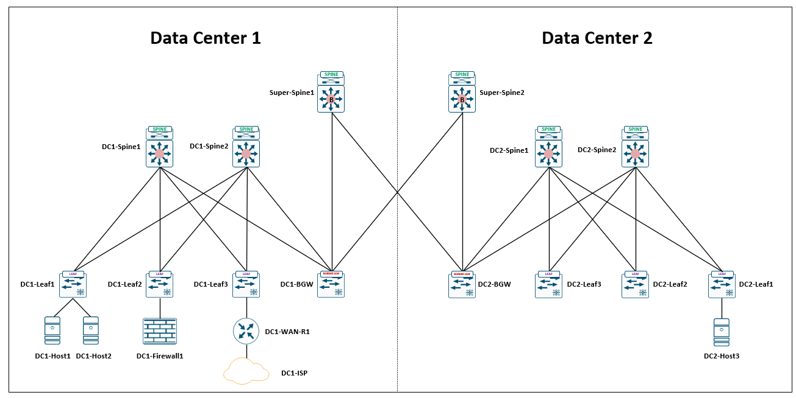

# VXLAN EVPN Data Center Lab

## Overview

This lab project aims to design and implement a scalable and secure data center network based on VXLAN EVPN technology. First, a VXLAN EVPN fabric is deployed in Data Center 1 to enable inter-VLAN communication, allowing hosts in different VLANs to communicate seamlessly through integrated Layer 2 and Layer 3 forwarding.

Second, service insertion is implemented within DC1 to integrate a firewall into the network, providing centralized security control for intra-data-center traffic. Third, a centralized route leaking mechanism is introduced to enable shared access to Internet resources within DC1, allowing different segments to utilize common external connectivity while maintaining logical separation.

Finally, an EVPN Multi-Site architecture is used to interconnect multiple data centers, enabling cross-site tenant communication. This allows hosts belonging to the same tenant but located in different data centers to communicate transparently, achieving seamless network extension across sites.

This repository includes topology diagrams, device configurations, and validation commands used to build and test the environment.

---

## Topology

The Visio network diagram shown above illustrates the overall architecture of this lab environment.

The EVE-NG network diagram shown above illustrates the detailed implementation of this lab environment.

### Network Design

- Spine-leaf Clos architecture
- Layer 3 underlay network
- VXLAN overlay network
- EVPN control plane using BGP
- Anycast gateway for distributed routing

---

## Lab Environment

| Component | Platform |
|---|---|
| Network Emulator | EVE-NG |
| Switch OS | Cisco Nexus 9000v |
| Routing Protocol | OSPF |
| Control Plane | BGP EVPN |
| Overlay Technology | VXLAN |

---

## IP Scheme

### DC1 Configuration

| Items                  | IP Address        | VLAN ID | VNI   |
|------------------------|------------------|--------|-------|
| DC1 Tenant 1 Group 100 | 192.168.100.0/24 | 100    | 10100 |
| DC1 Tenant 1 Group 110 | 192.168.110.0/24 | 110    | 10110 |
| DC1 Tenant 2 Group 200 | 192.168.200.0/24 | 200    | 10200 |
| DC1 Tenant 2 Group 210 | 192.168.210.0/24 | 210    | 10210 |
| DC1 Underlay Connection| 10.1.0.0/16      | NA     | NA    |
| DC1 Host 1             | 192.168.100.10   | 100    | 10100 |
| DC1 Host 2             | 192.168.110.20   | 110    | 10110 |

### DC2 Configuration

| Items                  | IP Address        | VLAN ID | VNI   |
|------------------------|------------------|--------|-------|
| DC2 Tenant 1 Group 100 | 192.168.100.0/24 | 100    | 20100 |
| DC2 Tenant 1 Group 110 | 192.168.110.0/24 | 110    | 20110 |
| DC2 Tenant 2 Group 200 | 192.168.200.0/24 | 200    | 20200 |
| DC2 Tenant 2 Group 210 | 192.168.210.0/24 | 210    | 20210 |
| DC2 Underlay Connection| 10.2.0.0/16      | NA     | NA    |
| DC2 Host 3             | 192.168.100.30   | 100    | 10100 |

---

## Device Configuration 
Please refer to project folder.
